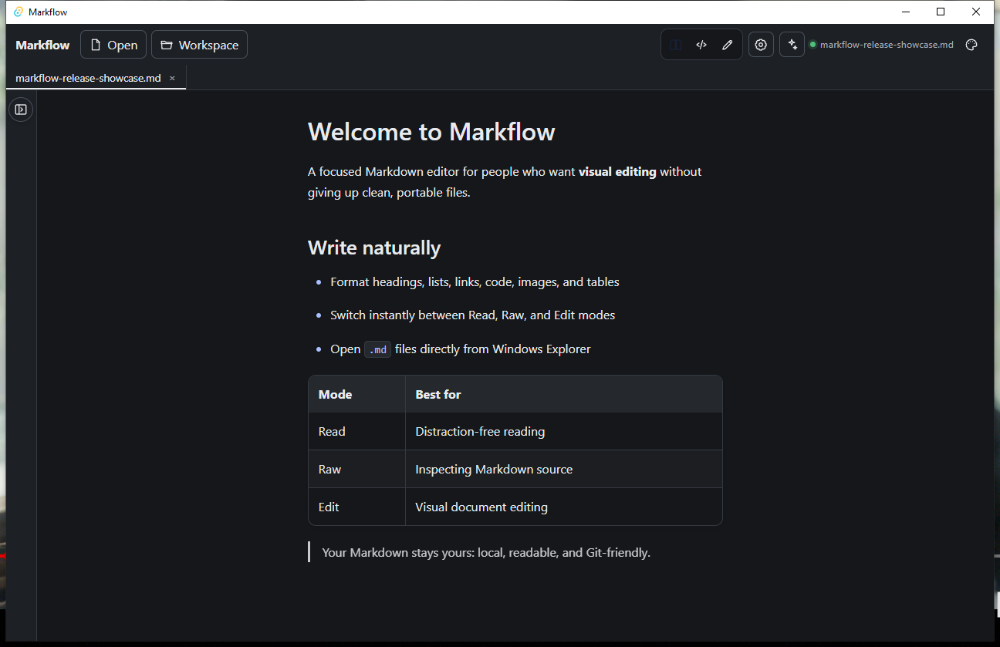

# Markflow

**A focused visual Markdown editor that keeps your files clean, portable, and Git-friendly.**

[](https://github.com/NahuelAparicio10/MarkflowNG/actions/workflows/ci.yml)
[](https://github.com/NahuelAparicio10/MarkflowNG/releases)
[](LICENSE)

Markflow combines a calm reading experience, visual editing, raw Markdown access, workspace navigation, and optional AI assistance in a native Windows application. Your documents remain ordinary `.md` files—there is no proprietary format and no cloud account requirement.

> **Status:** `v0.1.2` is a public Beta for Windows 10 and Windows 11.



## Highlights

- **Three document modes:** Read, Raw, and Edit.
- **Clean Markdown output:** headings, emphasis, links, lists, task lists, quotes, code blocks, tables, images, and thematic breaks.
- **Workspace navigation:** file tree, quick open, previews, tabs, and document outline.
- **Native Windows integration:** open `.md` files from Explorer, including paths with spaces and Unicode characters.
- **Safe editing:** autosave, external-change handling, atomic writes, and round-trip preservation tests.
- **Appearance:** Dark, Light, and Sepia themes.
- **Optional AI Beta:** ask about the open document or search an indexed workspace.

## Download

Download the latest Windows installer from [GitHub Releases](https://github.com/NahuelAparicio10/MarkflowNG/releases/latest):

- **NSIS installer** — recommended for most users.
- **MSI package** — useful for managed or manual Windows installations.

Markflow is not code-signed yet, so Windows SmartScreen may display an “unknown publisher” warning. Verify the SHA-256 hashes included in the release notes before running an installer.

## AI without a separate API key

Markflow can use models already connected through [OpenCode](https://opencode.ai/), including supported account-based and local providers.

1. Install OpenCode V2.
2. In OpenCode, run `/connect` and complete a supported sign-in flow.
3. In Markflow, open **AI settings**.
4. Select **OpenCode account or model** and choose **Detect OpenCode**.
5. Select a model, review the data-sharing notice, test the connection, and enable it.

Asking about the current document does not require workspace indexing. Multi-file questions use an optional local embedding model download of approximately 90 MB; embeddings and the index remain on the device.

### Privacy and security

- AI is disabled until you explicitly configure a provider.
- Markflow never reads OpenCode passwords, OAuth tokens, cookies, or credential databases.
- Prompts are sent to OpenCode through standard input, not command-line arguments.
- The OpenCode bridge runs in an isolated temporary workspace with all tools denied.
- Direct API credentials are stored in the operating-system credential store, never in project files.
- Remote models require explicit consent before document content is sent.

See [Architecture](docs/architecture.md) for the implementation and trust boundaries.

## Development

### Prerequisites

- Node.js 22+
- Rust stable
- Windows prerequisites for [Tauri 2](https://v2.tauri.app/start/prerequisites/)

```powershell
git clone https://github.com/NahuelAparicio10/MarkflowNG.git
cd MarkflowNG
npm ci
npm run tauri:dev
```

### Quality checks

```powershell
npm run lint
npm run typecheck
npm test
npm run test:e2e
cargo fmt --manifest-path src-tauri/Cargo.toml -- --check
cargo clippy --manifest-path src-tauri/Cargo.toml --all-targets -- -D warnings
cargo test --manifest-path src-tauri/Cargo.toml
```

Create release installers with:

```powershell
npm run tauri:build
```

Generated Windows bundles are written to `src-tauri/target/release/bundle/`.

## Project documentation

- [Architecture](docs/architecture.md)
- [Roadmap](docs/roadmap.md)
- [Performance baseline](docs/performance-baseline.md)
- [Changelog](CHANGELOG.md)

## Current limitations

- Only Windows builds have been packaged and validated for this Beta.
- AI and workspace retrieval remain Beta features.
- Embedded OAuth/device-code onboarding is deferred; account connection is completed safely in OpenCode with `/connect`.
- Release binaries are not yet code-signed.

## Contributing

Issues and focused pull requests are welcome. Before submitting a change, run the quality checks above and keep Markdown serialization behavior covered by round-trip tests.

## License

Markflow is available under the [MIT License](LICENSE).
